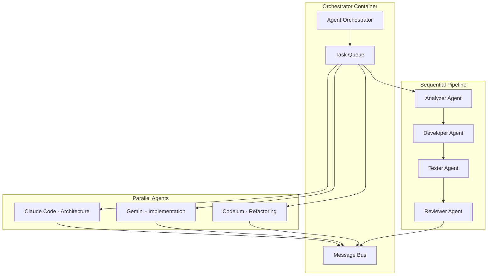

# Multi-Agent Orchestration for Docker Dev Environments

## Architecture Overview



## 1. Parallel Agent Patterns

### When to Use Parallel Agents
- **Code Review**: Multiple perspectives simultaneously
- **Bug Hunting**: Different agents check different aspects
- **Documentation**: Generate user docs, API docs, and comments concurrently
- **Testing**: Unit tests, integration tests, and E2E tests in parallel
- **Refactoring**: Multiple files can be refactored independently

### Parallel Configuration

```yaml
# docker-compose.parallel-agents.yml
version: '3.8'

services:
  orchestrator:
    build: ./orchestrator
    volumes:
      - ./workspace:/workspace
      - /var/run/docker.sock:/var/run/docker.sock
    environment:
      - ORCHESTRATION_MODE=parallel
      - MAX_PARALLEL_AGENTS=3
    networks:
      - agent-network

  claude-architect:
    image: claude-agent:latest
    environment:
      - AGENT_ROLE=architect
      - CLAUDE_MODEL=claude-3-opus
      - FOCUS_AREAS=design,patterns,structure
    volumes:
      - ./workspace:/workspace:ro
    networks:
      - agent-network
    deploy:
      resources:
        limits:
          memory: 2G
          cpus: '1.0'

  gemini-implementer:
    image: gemini-agent:latest
    environment:
      - AGENT_ROLE=implementer
      - GEMINI_MODEL=gemini-2.5-pro
      - FOCUS_AREAS=coding,algorithms,optimization
    volumes:
      - ./workspace:/workspace
    networks:
      - agent-network
    deploy:
      resources:
        limits:
          memory: 2G
          cpus: '1.0'

  codeium-refactor:
    image: codeium-agent:latest
    environment:
      - AGENT_ROLE=refactorer
      - FOCUS_AREAS=cleanup,performance,patterns
    volumes:
      - ./workspace:/workspace
    networks:
      - agent-network
    deploy:
      resources:
        limits:
          memory: 1G
          cpus: '0.5'

networks:
  agent-network:
    driver: bridge
```

## 2. Sequential Agent Patterns

### When to Use Sequential Agents
- **Feature Development**: Analyze → Design → Implement → Test → Review
- **Debugging**: Reproduce → Isolate → Fix → Verify
- **Migration**: Analyze legacy → Plan migration → Execute → Validate
- **Security Audit**: Scan → Analyze → Patch → Verify
- **Performance Optimization**: Profile → Identify → Optimize → Benchmark

### Sequential Pipeline Configuration

```yaml
# docker-compose.sequential-agents.yml
version: '3.8'

services:
  orchestrator:
    build: ./orchestrator
    environment:
      - ORCHESTRATION_MODE=sequential
      - PIPELINE_CONFIG=/config/pipeline.json
    volumes:
      - ./workspace:/workspace
      - ./config:/config
      - ./artifacts:/artifacts

  stage1-analyzer:
    image: claude-agent:latest
    environment:
      - AGENT_STAGE=1
      - AGENT_ROLE=analyzer
      - OUTPUT_PATH=/artifacts/analysis.json
    volumes:
      - ./workspace:/workspace:ro
      - ./artifacts:/artifacts
    depends_on:
      - orchestrator

  stage2-designer:
    image: gemini-agent:latest
    environment:
      - AGENT_STAGE=2
      - AGENT_ROLE=designer
      - INPUT_PATH=/artifacts/analysis.json
      - OUTPUT_PATH=/artifacts/design.json
    volumes:
      - ./workspace:/workspace:ro
      - ./artifacts:/artifacts
    depends_on:
      - stage1-analyzer

  stage3-developer:
    image: claude-agent:latest
    environment:
      - AGENT_STAGE=3
      - AGENT_ROLE=developer
      - INPUT_PATH=/artifacts/design.json
      - OUTPUT_PATH=/artifacts/implementation
    volumes:
      - ./workspace:/workspace
      - ./artifacts:/artifacts
    depends_on:
      - stage2-designer

  stage4-tester:
    image: testing-agent:latest
    environment:
      - AGENT_STAGE=4
      - AGENT_ROLE=tester
      - INPUT_PATH=/artifacts/implementation
      - OUTPUT_PATH=/artifacts/test-results.json
    volumes:
      - ./workspace:/workspace
      - ./artifacts:/artifacts
    depends_on:
      - stage3-developer
```

## 3. Hybrid Orchestration Patterns

### Smart Task Routing

```python
# orchestrator/task_router.py
class TaskRouter:
    def __init__(self):
        self.parallel_tasks = {
            'code_review': ['style_check', 'security_scan', 'performance_analysis'],
            'documentation': ['api_docs', 'user_guide', 'changelog'],
            'testing': ['unit_tests', 'integration_tests', 'e2e_tests'],
            'refactoring': ['dead_code', 'duplicate_code', 'complexity']
        }
        
        self.sequential_tasks = {
            'feature': ['analyze', 'design', 'implement', 'test', 'document'],
            'bugfix': ['reproduce', 'isolate', 'fix', 'verify'],
            'optimization': ['profile', 'identify', 'optimize', 'benchmark']
        }
    
    def route_task(self, task_type, task_data):
        if task_type in self.parallel_tasks:
            return self.execute_parallel(task_type, task_data)
        elif task_type in self.sequential_tasks:
            return self.execute_sequential(task_type, task_data)
        else:
            return self.execute_hybrid(task_type, task_data)
    
    def execute_hybrid(self, task_type, task_data):
        # Example: Sequential phases with parallel execution within each phase
        phases = [
            {'name': 'analysis', 'agents': ['claude', 'gemini'], 'parallel': True},
            {'name': 'implementation', 'agents': ['claude'], 'parallel': False},
            {'name': 'testing', 'agents': ['pytest', 'cypress', 'k6'], 'parallel': True},
            {'name': 'review', 'agents': ['claude', 'coderabbit'], 'parallel': True}
        ]
        return self.orchestrate_phases(phases, task_data)
```

## 4. Agent Communication Protocol

### Message Bus Configuration

```yaml
# redis-message-bus.yml
services:
  redis:
    image: redis:7-alpine
    ports:
      - "6379:6379"
    volumes:
      - redis-data:/data
    command: redis-server --appendonly yes

  redis-commander:
    image: rediscommander/redis-commander:latest
    environment:
      - REDIS_HOSTS=local:redis:6379
    ports:
      - "8081:8081"
```

### Inter-Agent Communication

```python
# shared/agent_communication.py
import redis
import json
from typing import Dict, Any

class AgentMessenger:
    def __init__(self, agent_id: str):
        self.agent_id = agent_id
        self.redis_client = redis.Redis(host='redis', port=6379, decode_responses=True)
        self.subscribe_to_broadcasts()
    
    def send_message(self, recipient: str, message: Dict[str, Any]):
        channel = f"agent:{recipient}"
        self.redis_client.publish(channel, json.dumps({
            'from': self.agent_id,
            'to': recipient,
            'message': message,
            'timestamp': time.time()
        }))
    
    def broadcast(self, event_type: str, data: Any):
        self.redis_client.publish('broadcast', json.dumps({
            'agent': self.agent_id,
            'event': event_type,
            'data': data
        }))
    
    def get_shared_context(self) -> Dict:
        return json.loads(self.redis_client.get('shared_context') or '{}')
    
    def update_shared_context(self, updates: Dict):
        context = self.get_shared_context()
        context.update(updates)
        self.redis_client.set('shared_context', json.dumps(context))
```

## 5. Resource Management

### Dynamic Resource Allocation

```yaml
# resource-manager.yml
services:
  resource-manager:
    build: ./resource-manager
    environment:
      - MAX_TOTAL_MEMORY=16G
      - MAX_TOTAL_CPU=8
      - AGENT_PRIORITY_WEIGHTS=claude:3,gemini:2,codeium:1
    volumes:
      - /var/run/docker.sock:/var/run/docker.sock
    deploy:
      placement:
        constraints:
          - node.role == manager
```

### Resource Monitoring Script

```python
# resource-manager/monitor.py
import docker
import psutil
from typing import Dict

class ResourceMonitor:
    def __init__(self):
        self.client = docker.from_env()
        self.thresholds = {
            'memory': 0.8,  # 80% threshold
            'cpu': 0.9      # 90% threshold
        }
    
    def get_agent_resources(self) -> Dict:
        resources = {}
        for container in self.client.containers.list():
            if 'agent' in container.name:
                stats = container.stats(stream=False)
                resources[container.name] = {
                    'memory': self.parse_memory(stats),
                    'cpu': self.parse_cpu(stats),
                    'status': container.status
                }
        return resources
    
    def auto_scale(self):
        resources = self.get_agent_resources()
        system = psutil.virtual_memory()
        
        if system.percent > 80:
            # Scale down non-critical agents
            self.scale_down_agents(['codeium', 'coderabbit'])
        elif system.percent < 50:
            # Scale up if resources available
            self.scale_up_agents(['claude', 'gemini'])
    
    def scale_down_agents(self, agent_types):
        for container in self.client.containers.list():
            if any(agent in container.name for agent in agent_types):
                container.update(mem_limit='512m', cpu_quota=50000)
    
    def scale_up_agents(self, agent_types):
        for container in self.client.containers.list():
            if any(agent in container.name for agent in agent_types):
                container.update(mem_limit='2g', cpu_quota=100000)
```

## 6. Practical Implementation Examples

### Example 1: Full-Stack Feature Development

```bash
#!/bin/bash
# launch-feature-development.sh

# Sequential phases with parallel execution within phases
docker-compose -f docker-compose.orchestrator.yml up -d

# Phase 1: Parallel analysis
docker run --network agent-network claude-agent analyze-requirements &
docker run --network agent-network gemini-agent analyze-existing-code &
wait

# Phase 2: Sequential design
docker run --network agent-network claude-agent create-architecture
docker run --network agent-network gemini-agent review-architecture

# Phase 3: Parallel implementation
docker run --network agent-network claude-agent implement-backend &
docker run --network agent-network gemini-agent implement-frontend &
docker run --network agent-network codeium-agent create-tests &
wait

# Phase 4: Sequential review
docker run --network agent-network claude-agent final-review
docker run --network agent-network gemini-agent security-check
```

### Example 2: Bug Fix Pipeline

```yaml
# bugfix-pipeline.yml
version: '3.8'

x-agent-base: &agent-base
  networks:
    - bugfix-network
  volumes:
    - ./workspace:/workspace
    - ./bug-artifacts:/artifacts

services:
  # Sequential pipeline for bug fixing
  bug-reproducer:
    <<: *agent-base
    image: testing-agent:latest
    command: reproduce-bug --issue-id=${ISSUE_ID}
    
  bug-analyzer:
    <<: *agent-base
    image: claude-agent:latest
    command: analyze-bug --input=/artifacts/reproduction.log
    depends_on:
      bug-reproducer:
        condition: service_completed_successfully
  
  # Parallel fix attempts
  fix-attempt-1:
    <<: *agent-base
    image: claude-agent:latest
    command: implement-fix --strategy=minimal
    depends_on:
      bug-analyzer:
        condition: service_completed_successfully
        
  fix-attempt-2:
    <<: *agent-base
    image: gemini-agent:latest
    command: implement-fix --strategy=comprehensive
    depends_on:
      bug-analyzer:
        condition: service_completed_successfully
  
  # Sequential verification
  fix-selector:
    <<: *agent-base
    image: orchestrator:latest
    command: select-best-fix
    depends_on:
      - fix-attempt-1
      - fix-attempt-2
      
  fix-verifier:
    <<: *agent-base
    image: testing-agent:latest
    command: verify-fix
    depends_on:
      fix-selector:
        condition: service_completed_successfully
```

### Example 3: Code Review Parallel Swarm

```python
# code-review-swarm.py
import asyncio
from typing import List, Dict

class CodeReviewSwarm:
    def __init__(self, pr_number: int):
        self.pr_number = pr_number
        self.agents = {
            'claude-security': {'focus': 'security vulnerabilities'},
            'gemini-performance': {'focus': 'performance issues'},
            'codeium-style': {'focus': 'code style and formatting'},
            'claude-logic': {'focus': 'business logic correctness'},
            'gemini-tests': {'focus': 'test coverage and quality'}
        }
    
    async def review_parallel(self) -> Dict:
        tasks = []
        for agent_name, config in self.agents.items():
            task = self.run_agent_review(agent_name, config)
            tasks.append(task)
        
        results = await asyncio.gather(*tasks)
        return self.consolidate_reviews(results)
    
    async def run_agent_review(self, agent_name: str, config: Dict):
        # Launch containerized agent
        cmd = f"docker run --rm {agent_name} review --pr={self.pr_number} --focus={config['focus']}"
        proc = await asyncio.create_subprocess_shell(
            cmd,
            stdout=asyncio.subprocess.PIPE,
            stderr=asyncio.subprocess.PIPE
        )
        stdout, stderr = await proc.communicate()
        return {
            'agent': agent_name,
            'review': stdout.decode(),
            'focus': config['focus']
        }
    
    def consolidate_reviews(self, reviews: List[Dict]) -> Dict:
        consolidated = {
            'critical': [],
            'warnings': [],
            'suggestions': [],
            'approvals': []
        }
        
        for review in reviews:
            # Parse and categorize feedback
            parsed = self.parse_review(review['review'])
            for category, items in parsed.items():
                consolidated[category].extend(items)
        
        return consolidated
```

## 7. Monitoring Dashboard

```yaml
# monitoring-stack.yml
version: '3.8'

services:
  prometheus:
    image: prom/prometheus:latest
    volumes:
      - ./prometheus.yml:/etc/prometheus/prometheus.yml
      - prometheus-data:/prometheus
    ports:
      - "9090:9090"
      
  grafana:
    image: grafana/grafana:latest
    environment:
      - GF_SECURITY_ADMIN_PASSWORD=admin
    volumes:
      - grafana-data:/var/lib/grafana
      - ./grafana/dashboards:/etc/grafana/provisioning/dashboards
    ports:
      - "3000:3000"
      
  cadvisor:
    image: gcr.io/cadvisor/cadvisor:latest
    volumes:
      - /:/rootfs:ro
      - /var/run:/var/run:ro
      - /sys:/sys:ro
      - /var/lib/docker:/var/lib/docker:ro
    ports:
      - "8080:8080"

volumes:
  prometheus-data:
  grafana-data:
```

## 8. Quick Start Commands

```bash
# Initialize multi-agent environment
./init-multi-agent-env.sh

# Launch parallel code review
docker-compose -f parallel-agents.yml up --scale claude-reviewer=2 --scale gemini-reviewer=2

# Run sequential feature pipeline
docker-compose -f sequential-pipeline.yml run orchestrator feature --name="user-auth"

# Hybrid mode for complex task
docker-compose -f hybrid-orchestration.yml run orchestrator complex-refactor --mode=smart

# Monitor resource usage
docker-compose -f monitoring-stack.yml up -d
open http://localhost:3000  # Grafana dashboard
```

## 9. Best Practices

### Parallel Execution
- **DO**: Use for independent tasks (reviews, tests, docs)
- **DO**: Implement timeouts to prevent hanging
- **DO**: Use message queues for result aggregation
- **DON'T**: Parallelize dependent operations
- **DON'T**: Exceed 3-4 agents per CPU core

### Sequential Execution
- **DO**: Use for workflows with clear dependencies
- **DO**: Pass artifacts between stages
- **DO**: Implement checkpoints for long pipelines
- **DON'T**: Make stages too granular
- **DON'T**: Skip error handling between stages

### Resource Management
- **DO**: Set memory/CPU limits per agent
- **DO**: Implement auto-scaling based on load
- **DO**: Monitor and alert on resource exhaustion
- **DON'T**: Oversubscribe system resources
- **DON'T**: Run without resource limits

### Communication
- **DO**: Use async messaging for parallel agents
- **DO**: Implement retry logic for failed messages
- **DO**: Log all inter-agent communication
- **DON'T**: Use synchronous blocking calls
- **DON'T**: Share mutable state directly